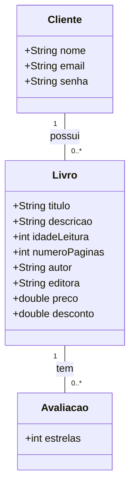

## Diagrama de Classes

```mermaid
classDiagram
    class Cliente {
        +String nome
        +String email
        +String senha
    }

    class Livro {
        +String titulo
        +String descricao
        +int idadeLeitura
        +int numeroPaginas
        +String autor
        +String editora
        +double preco
        +double desconto
    }

    class Avaliacao {
        +int estrelas
    }

    Cliente "1" -- "0..*" Livro : possui
    Livro "1" -- "0..*" Avaliacao : tem
```
