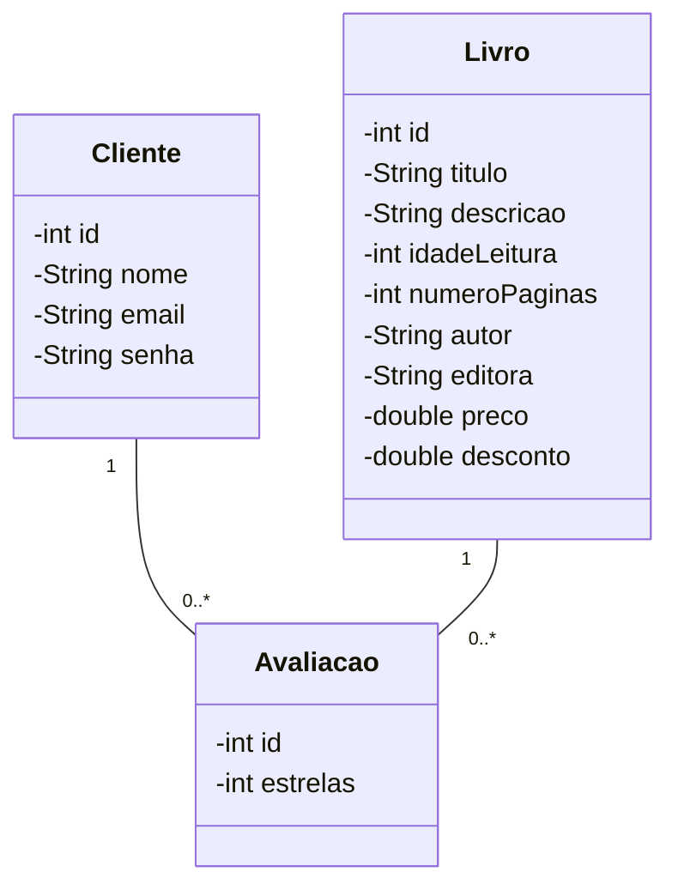

## Diagrama de Classes

```mermaid
classDiagram
    class Cliente {
        -int id
        -String nome
        -String email
        -String senha
    }

    class Livro {
        -int id
        -String titulo
        -String descricao
        -int idadeLeitura
        -int numeroPaginas
        -String autor
        -String editora
        -double preco
        -double desconto
    }

    class Avaliacao {
        -int id
        -int estrelas
    }

    Cliente "1" -- "0..*" Avaliacao
    Livro "1" -- "0..*" Avaliacao

```
